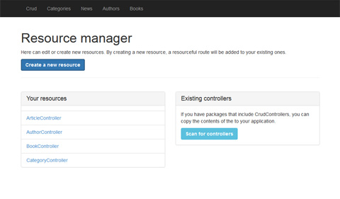

Crud
====
With this package you can:

* Build a form dynamically with the [Form Builder] (http://github.com/illuminate3/Form) and have that form reflect your model. 
* Generate Eloquent models with your form using the [Model Builder] (http://github.com/illuminate3/Model).
* Have an admin interface for your models using the [Overview Builder] (http://github.com/illuminate3/Overview).
* Point a resource route to a CrudController instance and you are ready to rock!
* Use the include Manager UI to create skeleton controllers for you.


## Install
Use [Composer] (http://getcomposer.org) to install the package into your application
```json
require {
    "illuminate3/crud": "dev-master"
}
```

Then add the following line in app/config/app.php:
```php
...
"Illuminate3\Crud\CrudServiceProvider"
...
```

## Example usage
The first thing we need to do is create a controller that extends from the CrudController.
This CrudController expects 3 methods to be implemented, just like the example below.
> I am assuming you have a working database connection in your app/config/database.php file. 
> Otherwise there will be no magic!

```php
<?php

use Illuminate3\Crud\CrudController;
use Illuminate3\Form\FormBuilder;
use Illuminate3\Model\ModelBuilder;
use Illuminate3\Overview\OverviewBuilder;

class NewsController extends CrudController
{

    public function buildForm(FormBuilder $fb)
    {
        $fb->text('title')->label('Title')->rules('required|alpha');
        $fb->textarea('body')->label('Body');
        $fb->radio('online')->choices(array('no', 'yes'))->label('Show online?');
        $fb->modelSelect('category_id')
           ->model('Category')
           ->label('Choose a category');
    }
    
    public function buildModel(ModelBuilder $mb)
    {
        $mb->name('Article')
        $mb->table('articles');
        $mb->autoGenerate();
    }
    
    public function buildOverview(OverviewBuilder $ob)
    {
        $ob->fields(array('title', 'body');
        $ob->order('title');
    }

}
```

After you have created your controller, just create a resourceful route pointing to your controller.
```php
Route::resource('admin/news', 'NewsController');
```

That's it. Open your browser and enter the route you just created.

## Auto-generating models
You might have noticed that your Eloquent model does not exist yet. 
So have the hell is this baby working one might ask.
Well, the package checks if the model exists yet in the IoC container.
If it doesn't, then the Eloquent model file is written and the database table is created.

```php
class My\Fancy\ArticleController extends CrudController
{
    public function buildModel(ModelBuilder $mb)
    {
        $mb->autoGenerate();
    }
}

```

If your database table already exists, it will add only the non-existing columns.
If you don't want to generate or update the database tables, just remove this line from
the modelBuilder instance. You can also add false as a parameter to the autoGenerate method.

## View mode
Sometimes you want to have a slightly different form if your creating or editing.
This can be tackled with some helper methods:
- isOverview
- isCreate
- isEdit
- isDelete

```php
public function buildForm(FormBuilder $fb)
{
    $title = $fb->text('title')->label('My title');
    
    if($this->isOverview()) {
        $title->label('Changed label in the overview');
    }
}
```

## Change the Config file
You can edit several options for each crud controller with just a simple config array.
One way to this is, is to override the config() method in your controller.
It just needs an array returned with the right format. 
The format is explained in the annotation of the method itself.
```php
class My\Fancy\ArticleController extends CrudController
{
    public function config()
    {
        return array(
        	'view' => array(
        		'index'     => 'crud::crud.index',
        		'create'    => 'crud::crud.create',
        		'edit'      => 'crud::crud.edit',
        	),
        	'redirects' => array(
        	    'success' => array(
        	        'store'     => 'admin.article.index',
        	        'update'    => 'admin.article.index',
        	        'delete'    => 'admin.article.index',
        	    ),
        	    'error' => array(
        	        'store'     => 'admin.article.create',
        	        'update'    => 'admin.article.edit',
        	        'delete'    => 'admin.article.index',
        	    )
        	)
        );
    }
}
```

## Manage your controllers


This package comes with a handy manager interface. 
It lets you generate new crud controllers with a simple form.
You can also copy crud controllers from existing packages and put them in your application folder.
That way you have total control of the crud controller without changing the original package.

The manager sits under this url:
```
http://{yourdomain}/crud
```
From there yout can generate a fresh controller file or convert an existing one from a package.
It will also add a resourceful route to your existing routes. 
After creating a new controller, you will be redirected to your new resource right away!
Just add some fields to you FormBuilder instance in the controller and you can enjoy the power of this Crud package.

## Your application
Here are some examples of how you can benifit more of the Crud package in your application.

- [Notify the user to add some form elements] (https://gist.github.com/illuminate3/6822421)
- [How to add a layout to your package] (https://gist.github.com/illuminate3/6822567)
- [Quickly add a menu to your layout] (https://gist.github.com/illuminate3/6822661)
